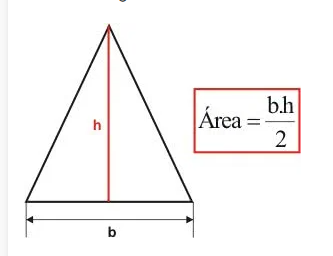
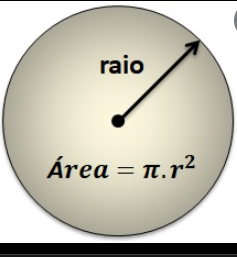

# Treinando programação e lógica

## Algoritmos em C# para aprimoramento de códigos e lógica.

- [X] Ler a base e a altura e calcular a **área do triangulo**

  

- [X] Ler a idade e calcular o número de dias.
- [X] Ler um numero e mostrar seu antecessor e sucessor.
- [X] Ler o raio do circulo e mostra a área, formula:

  

- [X] Ler a distância e retornar a quantidade de litros de combustivel necessária para percorrer-la. Sabendo que um automovel faz 12km/l.

## Estruturas de decisão simples

- [X] Desenvolva um codigo que leia a altura de uma pessoa. Devera imprimir " Alto"  se a altura for maior que 1,80 ou igual; caso contrário, deverá imprimir "Baixo".

- [X] Desenvolva um código que leia dois valores inteiros positivos e que os imprima em ordem crescente.

- [] Desenvolva um código que leia o nome de dois times e o número de gols marcados na partida (para cada time). O nome do vencedor deverá ser escrito. Caso não haja um, deverá ser impressa a palavra “empate”.

